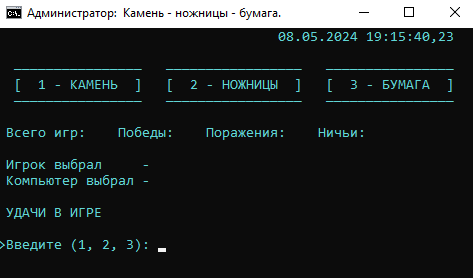

# **Камень - ножницы - бумага**
Это простая консольная игра "Камень - ножницы - бумага" для Windows, написанная на языке пакетных команд (batch).
## **Описание**
Игра позволяет вам сразиться с компьютером в классическую игру "Камень - ножницы - бумага". Выберите один из трех предметов (камень, ножницы или бумага), а затем посмотрите, кто победил: вы или компьютер.
## **Как играть**
1. Запустите файл **game.bat**.
1. Введите число 1, 2 или 3 в соответствии с вашим выбором:
   1. 1: Камень
   1. 2: Ножницы
   1. 3: Бумага
1. Посмотрите результат игры.
## **Команды**
- **1**: Камень
- **2**: Ножницы
- **3**: Бумага
## **Установка и запуск**
1. Скачайте или клонируйте репозиторий с игрой.
1. Запустите файл **game.bat**.
## **Демонстрация работы**

