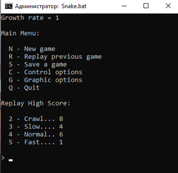

# **Змейка в командной строке**
Этот скрипт представляет собой простую игру в змейку, которая работает в командной строке Windows. Он позволяет игроку управлять змейкой, собирать еду и увеличиваться в размере, избегая столкновений со стенами и самой собой.
## **Как играть**
1. **Запуск игры:** Запустите скрипт с параметром **startGame**, чтобы начать игру. Змейка будет отображаться в окне командной строки.
1. **Управление:** Используйте клавиши управления, чтобы направлять змейку:
   1. Вверх: **W**
   1. Вниз: **S**
   1. Влево: **A**
   1. Вправо: **D**
   1. Пауза: **P**
1. **Цель игры:** Соберите как можно больше еды, чтобы змейка выросла. Избегайте столкновений со стенами или собственным телом.
1. **Пауза и выход:** Нажмите клавишу **P**, чтобы приостановить игру. Чтобы выйти из игры, нажмите **Q**.
1. **Настройки:** В файле **SnakeUserPref.txt** можно настроить различные параметры игры, такие как скорость и клавиши управления.
1. **Загрузка и сохранение:** Есть возможность загрузить сохраненные игры или сохранить текущую игру для продолжения позже.
1. **Реплей:** Можно просматривать реплеи предыдущих игр.
## **Требования**
- ОС: Windows
- Командная строка Windows
## **Запуск**
Для запуска игры просто запустите скрипт **Snake.bat**

# Демонстрация работы

